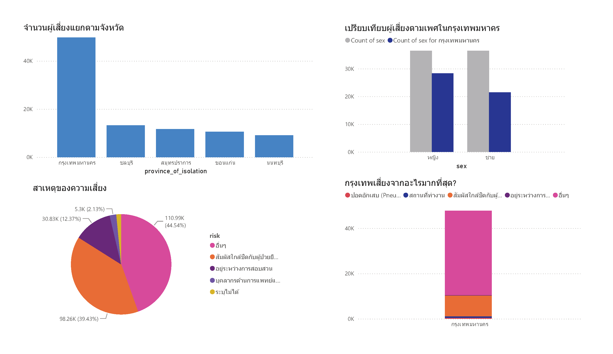

# 📊 COVID-19 Risk Analysis Dashboard

## 📌 Overview

This project analyzes COVID-19 risk data using Power BI to identify key patterns in risk distribution across provinces, gender, and causes.

---

## 📁 Dataset

* Source: Public COVID-19 dataset (Thailand)
* Columns:

  * province_of_isolation
  * sex
  * risk

---

## 🧹 Data Cleaning

* Removed duplicates
* Handled missing values
* Standardized data format

---

## 📊 Dashboard

---

## 🔍 Key Insights

* กรุงเทพมหานครเป็นพื้นที่ที่มีความเสี่ยงสูงที่สุดอย่างมีนัยสำคัญ
* ผู้หญิงมีจำนวนผู้เสี่ยงมากกว่าผู้ชาย โดยเฉพาะในกรุงเทพมหานคร
* สาเหตุความเสี่ยงส่วนใหญ่ถูกจัดอยู่ในหมวด "อื่นๆ"
* การสัมผัสใกล้ชิดกับผู้ป่วยยืนยันเป็นปัจจัยเสี่ยงหลักอันดับสอง
* ความเสี่ยงมีลักษณะกระจุกตัวทั้งในเชิงพื้นที่และเชิงสาเหตุ

---

## 🛠 Tools Used

* Power BI
* Microsoft Excel

---

## 🚀 Author

Your Name
